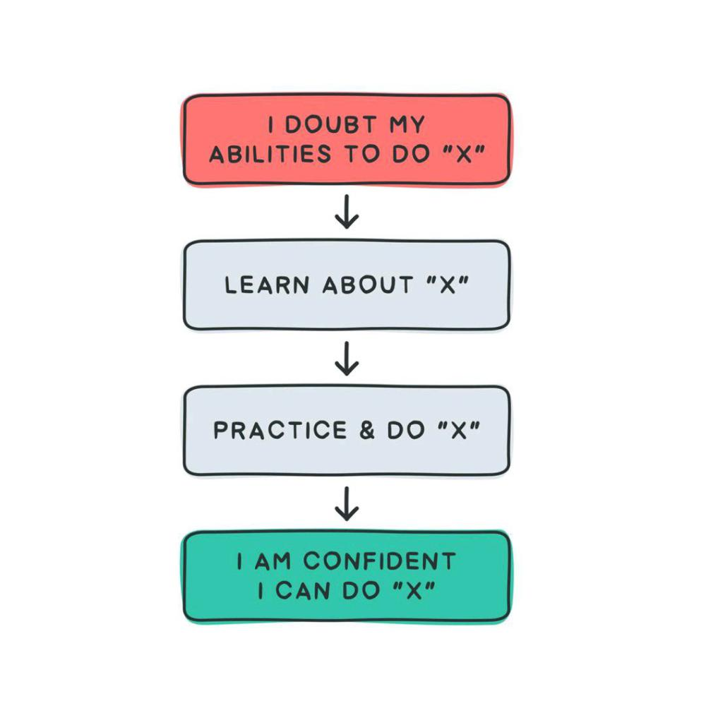

# Leetcode Challenge

## Qual a motivação da criação desse repositório?

Acredito que um dos maiores desafios na carreira de um Dev é a lógica de programação. Sendo assim, existem plataformas como o LeetCode que permitem que programadores aprimorem sua lógica resolvendo desafios constantemente. Logo, criei esse repositório com o intuito de disponibilizar as soluções implementadas para desafios resolvidos no LeetCode.

O que você irá encontrar aqui:

- Os desafios estão separados de acordo com o nível de dificuldade: Easy, Medium e Hard;
- As soluções implementadas podem ser facilmente copiadas e coladas no console do LeetCode para teste;
- Além disso, cada módulo contém um bloco de códigos para teste local,bloco esse que deverá ser ignorado caso o teste seja rodado no console do LeetCode;

> "Stay hungry stay foolish" - Steve Jobs
